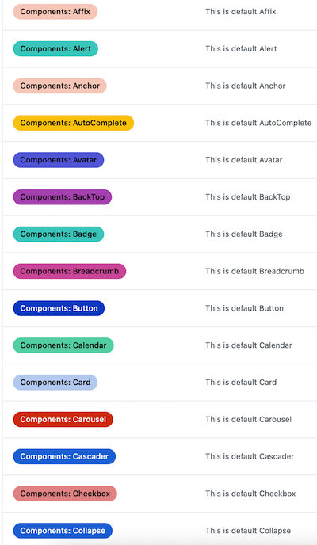

🚀 Labels Helper

Automatically create and delete labels in batches.

Since this operation is generally one-off, it is not made into GitHub Actions. You can run directly locally.

## 💄 Preview

## 📦 How to use ?

<kbd>Environment: node</kbd>

1. Fork this repository
2. Modify `create.json` and `delete.json`
3. `yarn run create` to create labels
4. `yarn run delete` to delete labels

## LICENSE

[MIT](./LICENSE)

> This is just a simple example, you can customize various rules on this basis.
